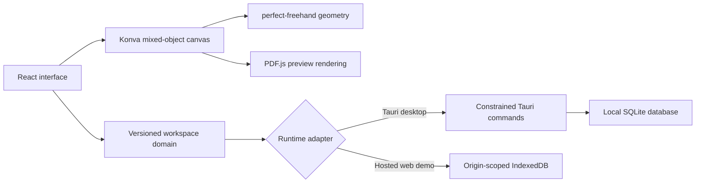

# Architecture

## Status

This document describes the current 0.x alpha architecture. It distinguishes the current foundation from future work. The design favors a small, inspectable local core over premature sync or collaboration abstractions.

## System shape



The React application owns interaction state and calls pure domain operations. The storage adapter is selected by runtime. This keeps notebook semantics independent from Tauri and makes the browser build useful as a limited demo.

## Logical domain

The root `WorkspaceState` has this ordered nesting:

```text
WorkspaceState
├── notebooks[]
│   └── sections[]
│       └── pages[]
│           └── elements[]
├── trash[]
└── active notebook, section, and page IDs
```

Array order is user-visible order. Page element order is also the default z-order. IDs are opaque and stable. Timestamps are ISO 8601 strings in UTC.

A page has either `free` or `a4` mode. Every page element shares the same top-left coordinate space:

- `stroke` stores pen or highlighter samples and visual settings
- `text` stores plain text, dimensions, and basic typography
- `image` stores a data URL, name, alt text, and dimensions in the alpha schema
- `pdf` stores a preview data URL, source name, page count, and dimensions in the alpha schema

This mixed-object scene is the central product primitive. The text editor and ink engine do not maintain separate pages.

## Rendering and input

React provides navigation, toolbars, panels, and lifecycle state. React Konva maps the ordered scene onto a canvas stage. Konva handles spatial transforms and hit testing. `perfect-freehand` converts pointer samples into filled vector outlines.

Pointer pressure, tilt, time, and pointer type are kept when available. Browsers and devices vary, so absence of useful pressure or tilt must not corrupt a stroke. PDF.js parses PDFs locally for preview rendering. PDF parsing is treated as untrusted-input handling, not as a trusted document conversion service.

## Persistence boundary

### Desktop

The desktop process is authoritative for desktop persistence. The webview sends a versioned workspace scene through a narrow Tauri command surface. Rust validates the request envelope and stores the scene in SQLite.

For schema v1, each save validates the complete scene, then replaces the normalized notebook, section, page, and element rows in one `IMMEDIATE` transaction. Tool-specific payloads remain JSON, ordering is stored explicitly, and an FTS5 search index is rebuilt in the same transaction. This provides typed relationships and deterministic rehydration, but a save can still rewrite the full workspace. It is suitable for an alpha, not proof of large-notebook scalability.

The UI should only confirm a save after the Tauri command succeeds. Database writes use foreign keys, strict tables, WAL mode, and a transaction so a failed replacement leaves the previous commit intact. The save command reloads the committed rows before returning.

### Browser demo

The hosted `/app` route stores the same logical workspace in IndexedDB. The browser origin and profile are the security and durability boundary. Browser data is not synced to the desktop database and is not uploaded to a Canvink service.

IndexedDB is a demo adapter, not a fallback cloud service. Clearing site data can delete its contents.

## Interaction and recovery states

The default workspace opens a blank `Quick note`. Example and template pages are present in separate sections instead of taking over the active page. A non-modal guide can be skipped and reopened. Its dismissed state and interface text-size choice are optional browser UI preferences, not part of notebook content.

Schema v1 always keeps at least one notebook, one section in each notebook, and one page in each section. Creation supplies that next level, validation rejects empty containers, and trash actions protect the last container. Notebook and section empty states are therefore structurally unreachable; the actionable blank-page state is the first empty content surface.

On first initialization, the generated workspace is fully written before the interface reports `Saved locally`. Later edits use a debounced snapshot save. A failed save remains visible with `Retry save` and `Download rescue copy` actions. The rescue copy contains the current in-memory workspace.

During the debounce window, a second versioned snapshot is written to a recovery key in IndexedDB. In the desktop runtime this recovery key belongs to the packaged webview and remains separate from the authoritative SQLite database. A successful authoritative save clears only recovery data from the same editing session at or before the committed revision, so it cannot erase a newer draft. On startup, a structurally valid recovery snapshot that differs from the authoritative workspace blocks editing until the user restores it, downloads it, or explicitly keeps the saved copy. It never silently replaces saved data. This is crash-draft recovery, not page history or a backup schedule, and clearing browser or webview site data can remove it.

The browser build observes connectivity only to explain its boundary. Its production build registers a same-origin service worker on secure origins and localhost. The worker caches the application shell and content-hashed static assets, but it never handles notebook content. After the worker has installed and activated, the interface can reopen offline and load the last successfully saved workspace from IndexedDB. A first visit still requires the server, and this cache is neither sync nor crash recovery. The desktop editor does not need the hosted site for ordinary editing.

Search scans the currently loaded workspace snapshot. The UI does not claim an indexing phase, and the desktop FTS table is not currently queried by the React search flow. There is no device sync or cross-device conflict model. The browser Web Lock prevents a second tab from becoming another writer instead of attempting a merge, and the blocked tab presents this as a specific safe-write conflict rather than a generic load error.

## Landing page and application

The landing page and browser app share the Vite build but have separate routes. The same static artifact can run on Vercel or in the documented rootless self-host container. The container has no notebook volume because browser content remains in each origin's IndexedDB. The desktop app loads packaged assets and does not depend on the hosted site for ordinary editing.

The deployment platform can observe normal request metadata for hosted pages. That does not make notebook content telemetry, and the application must not transmit notebook scenes to analytics or marketing services.

## Trust boundaries

- The React webview is not trusted to access arbitrary local files.
- Tauri commands are narrow and validate input before disk access.
- SQLite and the browser origin are separate persistence domains.
- Images and PDFs are untrusted content.
- Release workflows and signing credentials are separate from pull-request workflows.
- Sync, plugins, and collaboration are outside the current alpha trust model.

Read [security-model.md](security-model.md) for threats and current limitations.

## Design constraints

1. Data integrity is more important than saving a few milliseconds.
2. A local-first claim must name the actual local authority.
3. Schema changes require migrations, tests, and documentation.
4. Optional future services must not become required for ordinary editing.
5. Feature claims must describe shipped behavior, not roadmap intent.
6. New native capabilities require the smallest practical Tauri permission surface.

## Known architectural limitations

- Snapshot persistence is not tuned for very large notebooks.
- Binary data URLs can inflate scene size and memory use.
- The alpha has no cross-device merge model.
- Browser storage is origin-scoped and easy for users to clear accidentally.
- Desktop data is not encrypted by Canvink.
- Import coverage, history, recovery diagnostics, and integrity tools remain early.

These limitations are reasons for focused follow-up work, not permission to hide risk from users.
