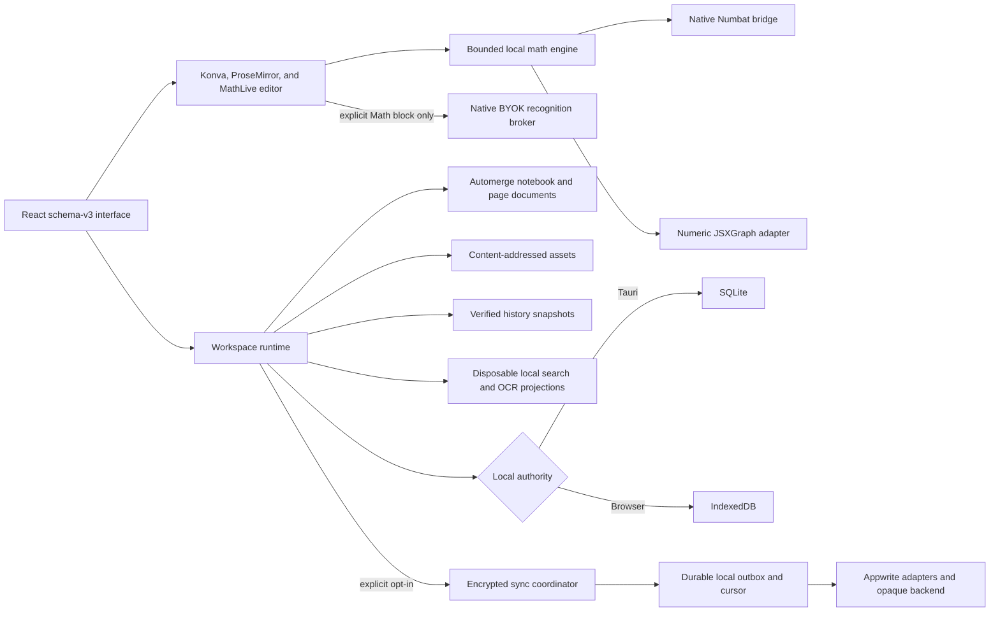

# Architecture

## Status and evidence boundary

This document describes the implementation in the current source tree. The mounted notebook application reads schema v2/v3 and writes schema v3; schema v1 is migration input and checked rollback evidence only. Implemented code and automated tests are not, by themselves, evidence of a beta, accepted handwriting corpus or target-GPU performance, deployed provider/sync service, accepted physical-device performance, or signed release. Those outstanding gates are tracked in the [acceptance matrix](acceptance-matrix.md).

## System shape


```mermaid
flowchart LR
  UI["React schema-v3 interface"] --> Runtime["Workspace runtime"]
  UI --> Canvas["Konva, ProseMirror, and MathLive editor"]
  Canvas --> Math["Bounded local math engine"]
  Math --> Units["Native Numbat bridge"]
  Math --> Graphs["Numeric JSXGraph adapter"]
  Canvas -->|"explicit Math block only"| Recognition["Native BYOK recognition broker"]
  Runtime --> Repo["Automerge notebook and page documents"]
  Runtime --> Assets["Content-addressed assets"]
  Runtime --> History["Verified history snapshots"]
  Runtime --> Search["Disposable local search and OCR projections"]
  Runtime --> Adapter{"Local authority"}
  Adapter -->|Tauri| SQLite["SQLite"]
  Adapter -->|Browser| IDB["IndexedDB"]
  Runtime -->|explicit opt-in| Sync["Encrypted sync coordinator"]
  Sync --> Outbox["Durable local outbox and cursor"]
  Outbox --> Appwrite["Appwrite adapters and opaque backend"]
```

The local authority opens and works without an account. Optional sync is a separate, explicit path: it extracts Automerge changes, encrypts and signs them, commits them to a durable local outbox, and then uses the Appwrite transport. The tracked Appwrite configuration is intentionally undeployed, so deterministic adapter and protocol tests are not live-service evidence.

## Schema-v3 document model

Each notebook index and each page is a separate Automerge document:

```text
activation:v3
├── notebook document URLs
├── page document URLs
├── verified Repo chunk descriptors
├── content-addressed asset IDs
└── active notebook, section, and page IDs

NotebookDoc
├── notebook metadata and settings
├── ordered sections
└── ordered page references

PageDoc
├── page metadata and background
├── optional math settings
├── elementsById
│   ├── existing v2 elements
│   ├── Math elements with immutable raw ink and derived recognition/results
│   └── Graph elements with Math-source references and viewport state
└── zOrder
```

`elementsById` is a stable map and `zOrder` is the explicit back-to-front order. Schema v3 adds `math` and `graph` to the existing closed element union. Live rich text has one authority at `elementsById[elementId].text`, edited through ProseMirror's Automerge binding. Math raw ink is canonical notebook content; recognition, corrected LaTeX, results, and dependency state are bounded fields derived without replacing that ink. Graph points are always derived locally from validated Math expressions and are never compiled expression code or canonical page data.

The visible application retains the historical `V2NotebookApp` component name but uses a v2/v3 runtime contract. Startup opens the notebook roots and the active page before exposing the workspace; other pages load on demand (see `automerge-architecture.md`, "Lazy page loading"). Merely opening v2 is non-mutating. The first writer performs one private, checked v2-to-v3 graph transition; public topology updates require an exact active-schema match and cannot downgrade. If activation is absent, the checked v1-to-v2 migration still stages real Automerge bytes, assets, a v1 backup, and activation metadata before the lazy v3 transition. A present but corrupt or mixed activation fails closed into recovery; it never silently falls back or creates an empty workspace.

### The phone app

The Android build (`pnpm build:android`, `CANVINK_VIEWER=1`) mounts a separate shell, `src/mobile/MobileApp.tsx`, instead of `V2NotebookApp`; `App.tsx` picks it from the build constant, so the phone bundle holds no desktop shell. It reads and searches notes, edits text and pins pages, and never writes ink (`applyPageElementChanges` drops ink changes in that build). `useMobileWorkspace` reuses the same runtime, write sessions, personal-space and shared-notebook sync, asset repository and search controller. Navigation is three bottom-bar destinations (Start, Notizbücher, Suche), each with its own stack of notebook, section and page screens (`navigation.ts`). Pages render in `LiveCanvasEditor` with its `reading` prop (`editor/readingViewport.ts`): fitted to the screen's width, bounded momentum panning with a stretch at the edges, double tap to zoom, a sideways swipe past the edge to turn the page, and text boxes zoomed to a typing size on focus.

`MainActivity.kt` draws the page edge to edge and passes the system bar insets, keyboard height and font scale to it; the keyboard shortens the window. A small JavaScript interface (`CanvinkBridge.kt`, typed in `src/mobile/nativeBridge.ts`) carries haptics, the end of the splash screen, the share sheet and the back gesture: while the page has a screen or sheet to close, the activity hands back (with its predictive progress on Android 14+) to `backStack.ts`; otherwise the system leaves the app. In a browser the same shell uses history entries for back.

## Editing and input

React owns navigation and interaction state. Konva renders the spatial scene, `perfect-freehand` converts bounded pointer samples into vector outlines, ProseMirror edits canonical rich text, and MathLive edits or corrects formulas. Implemented editor operations include pressure/tilt retention, palm rejection policy, lasso and multi-selection transforms, shapes, explicit atomic ink-to-Math conversion, bounded clipboard remapping, whole/point erasing with tombstone safety, and device-local three-way undo/redo that does not overwrite a remote change to the same field. Recognition scheduling requires an active local Math capability, waits for the 900 ms pen pause, and discards aborted or stale responses. Ordinary strokes, import, restore, reload, and sync cannot create that capability. The visible per-page ruler is a real interaction tool rather than a decorative shape: pointer and keyboard controls move and freely rotate it, and pen plus straight tools snap to its edge through zoom and pan; its position is device-local UI state.

The local Compute Engine path disables JIT compilation and admits only a bounded MathJSON subset. It produces exact and decimal values, page-ordered variables, school-level equation solutions, and numeric graph samples through an owned interpreter. Numbat receives only typed allowlisted unit identifiers through Rust; it never receives a raw user program. JSXGraph receives numeric arrays, not formula strings or JessieCode. Currency conversion requires a trusted local snapshot and always returns source and date metadata.

The source includes content-free performance instrumentation for pen-preview, cached-navigation, and storage-flush latency. Cached-navigation diagnostics have automated coverage. The pen acceptance exporter fails closed until it has observed at least 20 real samples spanning the exact 45-minute session and a p95 below 20 ms, then binds evidence to the exact commit and package version. Automated contract tests exercise that path without manufacturing live evidence; no qualifying physical-pen artifact has been accepted.

## Persistence and atomicity

### Windows desktop

Tauri exposes narrow, path-free commands. SQLite is authoritative for schema-v3 Repo chunks, activation, assets, history snapshots, the derived FTS search index, and optional sync outbox/cursors. Ordinary graph revisions compare the expected activation fingerprint and publish the new Repo image, added assets, receipt/rollback data where applicable, and replacement activation in one native transaction. The UI reports success only after the committed graph reopens and verifies.

The desktop-only recognition broker owns provider networking and credentials. Compatible endpoints and Mathpix use fixed paths, bounded requests/responses, no redirects, no ambient proxy, DNS/SSRF checks, and opaque errors. Provider secrets are protected for the current Windows user through DPAPI and are never returned to JavaScript. The web build has no persistent provider-secret path.

Windows DPAPI protects sync-device and private notebook key material for the current operating-system user. It does not encrypt ordinary notebook content at rest. The native and TypeScript boundaries are automatically tested, but a real packaged restart/unlock drill remains unrun.

The dedicated unsigned Windows packaging command is `pnpm tauri:build:windows`, which requests the NSIS and MSI bundles with the locked Rust dependency graph. This is a build path, not signing or release evidence; trusted-certificate signing uses a separate explicit preflight/overlay/verification path and remains externally gated.

### Browser

The `/app` route uses origin-scoped IndexedDB for schema-v3 authority. Activation, Repo chunks, assets, history, calculator history, search projections, and optional outbox state use explicit stores and bounded records. Atomic workspace revisions publish through the activation store; a blocked upgrade or malformed activation fails closed. Typed formulas, local evaluation, and graphs work offline; recognition and native units are explicitly unavailable. Clearing site data, private browsing, or changing origin/profile can remove or hide the local workspace.

The service worker caches only the same-origin application shell and content-hashed static assets. It does not cache notebook content. A first visit needs the site; after activation, the application shell can reopen offline and use IndexedDB. This is local offline use, not backup or sync.

## Assets, PDF, import, and export

Binary assets live outside Automerge as verified `sha256:<hex>` blobs. Reads re-hash bytes before returning them, and equal bytes deduplicate. The visible schema-v3 shell resolves image/PDF/attachment references, imports bounded originals, materializes local PDF previews, exports page/section/notebook PDFs plus page PNG/Markdown/current-schema JSON, and creates or additively imports `.canvink` bundles. Math is rendered as bounded static text and graphs as bounded polylines in portable outputs; current-schema JSON and bundles retain raw Math ink losslessly while excluding credentials and provider configuration. For a page backed by an original PDF, export copies the original source page structurally, removes actions, annotations, embedded-name trees, and form/open actions, then adds the Canvink overlay; it does not rasterize that source page. Other placed images and PDF preview elements still require bounded raster inputs. Attachments are passive: only allowlisted safe types may open in an isolated browser surface; active or unknown types first show a metadata-only inspection and require a separate explicit download.

The OneNote path is a bounded, additive Microsoft Graph importer with explicit delegated consent, URL/origin restrictions, inert HTML conversion, per-page fidelity reports, a reviewed artifact fingerprint, atomic commit, receipt, and guarded rollback. Packaged Tauri sign-in uses a native system-browser bridge that permits only Microsoft authorize/logout endpoints and an exact bounded loopback callback; browser builds retain MSAL redirect navigation. The review UI can attach a separately validated one-page local PDF to an individual source page, retaining distinct original-PDF and rendered-preview bytes as a locked visual background. Known `data-tag` variants become tags, task state, and checklists; safe unknown names use an `onenote:` tag and unrepresentable values remain fidelity issues. It is not broad OneNote parity, and a real Entra registration, consent, Graph responses, private notebooks, and representative PDF comparison remain external/personal acceptance gates.

## Search, OCR, and history

Search is a disposable local projection derived from live schema-v3 documents. It covers titles, tags, tasks, rich-text structures, checklist content, extracted PDF text, accepted OCR text, corrected/recognized/typed Math, visible results, and variable names. It deliberately excludes raw Math ink, alternative candidates, provider warnings, and credentials. Browser search uses a rebuildable IndexedDB index; Windows uses bounded local SQLite FTS5 projections. Corrupt or version-mismatched indexes are cleared and rebuilt from local authority rather than treated as notebook data.

Windows OCR uses the installed `Windows.Media.Ocr` runtime through narrow Tauri commands. There is no browser fallback or cloud OCR substitution. Automated tests cover adapter, queue, validation, and persistence behavior; installed language packs and representative personal scans have not been accepted.

History retains verified Automerge snapshots with heads, checksum, timestamp, device, and kind. Manual checkpoints, automatic checkpoints, trash checkpoints, guarded rotation, preview, delete, and copy-based restore are implemented. Restore creates a new verified page instead of rewinding the active document. This is not a device backup, and the separate personal backup/restore drill remains open.

## Optional encrypted sync

The sync client is integrated behind explicit configuration and sign-in. It includes Microsoft OAuth/email OTP adapters, notebook roles and invitations, device registration/approval/revocation, recovery kits, epoch-key envelopes, encrypted change and asset transport, a durable outbox, catch-up, server-reset recovery, Realtime wakeups, bounded ephemeral presence, and Automerge conflict visibility. Local changes remain authoritative and usable when sync is disabled.

The Appwrite backend and client are deterministic-testable, but the tracked project ID and endpoint are placeholders and no resource has been pushed. Two real accounts, real Realtime/catch-up, restoration, revocation propagation, near-limit payloads, and an exact 60-minute generated soak report remain required before any live-service claim.

## Optional personal-space cross-device sync

A second, separate optional sync surface — "Canvink Personal Space" (wire/UX
term: *space* / *persönlicher Bereich*) — lets a signed-in user's own notebooks,
page text, and image/PDF assets follow them between the desktop app and the
browser build. It is a distinct product surface from "Optional encrypted sync"
above: it shares the same Cloudflare Worker (`services/collab-sync`) and
`NotebookRoom` Durable Object class as notebook *sharing* (`PROTOCOL.md`), under
a new room kind (`"personal"`), rather than the separate, undeployed Appwrite
E2EE design. Design authority: `services/collab-sync/PERSONAL-SYNC.md`.

- One Durable Object room per signed-in Clerk user, keyed by a `spaceId`
  deterministically derived server-side from an HMAC-SHA256 of the user's
  Clerk `sub` (never client-supplied, never a credential by itself — every
  route still separately verifies the bearer JWT).
- Notebook/page topology (which notebooks and pages exist, their order, and
  trash) lives in one dedicated Automerge document (`docId: "workspace:root"`,
  `kind: "workspace"`) outside the local schema-v3 activation/Repo, so it can
  merge concurrently from multiple devices; it is materialised into the local
  workspace through `WorkspaceV2Runtime.commitWorkspaceGraphRevision`.
  `src/personal-space/**` is the only module tree allowed to call that write
  path from a network trigger — an ESLint `no-restricted-imports` rule enforces
  this over `src/collab/**` and `src/components/collab/**`, so a shared
  (sharing-feature) session can never silently write the local workspace.
- Image/PDF/attachment assets are proxied through the Worker to a dedicated
  Cloudflare R2 bucket, keyed `spaces/<spaceId>/<sha256hex>`; downloads are
  lazy (fetched on render demand, batched into the same
  `commitWorkspaceGraphRevision` adoption path used for topology), not eager on
  every startup.
- A brand-new device's first contact with an account that already holds data
  is a user choice (add the local workspace to the account, or load the
  account's workspace and keep the local one as a downloadable backup) — never
  an automatic merge of two independently created workspaces.
- Like notebook sharing, this surface has **no end-to-end encryption**: content
  is stored plaintext in the Durable Object and in R2. See
  [security-model.md](security-model.md) for the isolation argument this
  relies on instead.

## Live presence in shared notebooks

People in a shared notebook see each other's faces (Clerk picture or
initials), pointer, in-progress ink and work region. Presence travels as an
ephemeral frame on the sharing room's WebSocket and is never stored. The
owner's shared-room session reconciles offline work with the room after each
reconnect. Details, the transport decision and the offline weaknesses are in
[collaboration-and-presence.md](collaboration-and-presence.md).

## Trust boundaries

- The React webview cannot access arbitrary local paths; Tauri commands validate bounded inputs.
- Automerge documents and content-addressed assets are authoritative; search and OCR indexes are disposable projections.
- Browser and desktop stores are distinct local authorities unless the user explicitly enables sync.
- Images, PDFs, attachments, OneNote HTML/resources, bundles, and remote sync responses are untrusted inputs.
- The optional Appwrite service receives opaque encrypted protocol records, not clear notebook content; ordinary infrastructure metadata and bounded presence remain visible to that service.
- DPAPI protects key material, not the entire local notebook database.
- Provider networking can originate only from an explicit local Math selection through the native broker; credentials and provider configuration are not document fields.
- Signing credentials and release workflows are separate from application runtime and pull-request code.

Read [security-model.md](security-model.md), [sync-protocol.md](sync-protocol.md), and [adversarial-acceptance.md](adversarial-acceptance.md) for the detailed boundaries.

## Known limitations

- No tracked Appwrite project has been deployed or accepted with two real accounts.
- The exact 60-minute, 20-client sync report is not present until `scripts/run-sync-soak.mjs 60` completes and writes it.
- Real-pen 45-minute p95, personal OneNote/OCR/PDF fidelity, physical-device limits, target-Windows DPAPI restart, trusted-certificate signing, and signed installer verification remain unrun.
- The local SQLite/IndexedDB notebook authority is not application-encrypted at rest.
- Browser durability remains origin/profile scoped; history is not a device backup.
- Collaborative presence is bounded and ephemeral, and semantic layout conflicts still require a human decision.
- No public recognition service, accepted five-writer corpus, accepted target-GPU benchmark, or completed TexTeller data-rights review is present.
- Personal-space cross-device sync (previous section) has an observed, intermittent (roughly one run in three to four in this session's testing) delay in a brand-new second device's very first catch-up seeing a notebook the first device just created moments earlier, even after that device's own status has already reported "synced" and even after several forced reconnects. It is understood to be a data-delivery/durability timing issue between the first device finishing and the Worker/room durably holding the change, not a client-side bug this session's retry-and-reconnect mitigation (`src/components/personal-space/usePersonalSpaceSync.ts`) can fully close from the client alone; see the Wave 5 integration report for detail.
- Mobile applications, 3D graphs, advanced symbolic mathematics, complete OneNote parity, malware scanning, and an independent security audit are not present.

These are acceptance boundaries, not permission to market the source tree as a beta or release.
